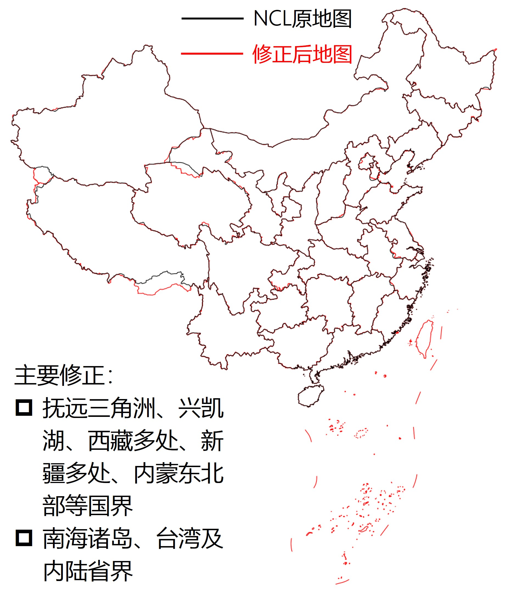
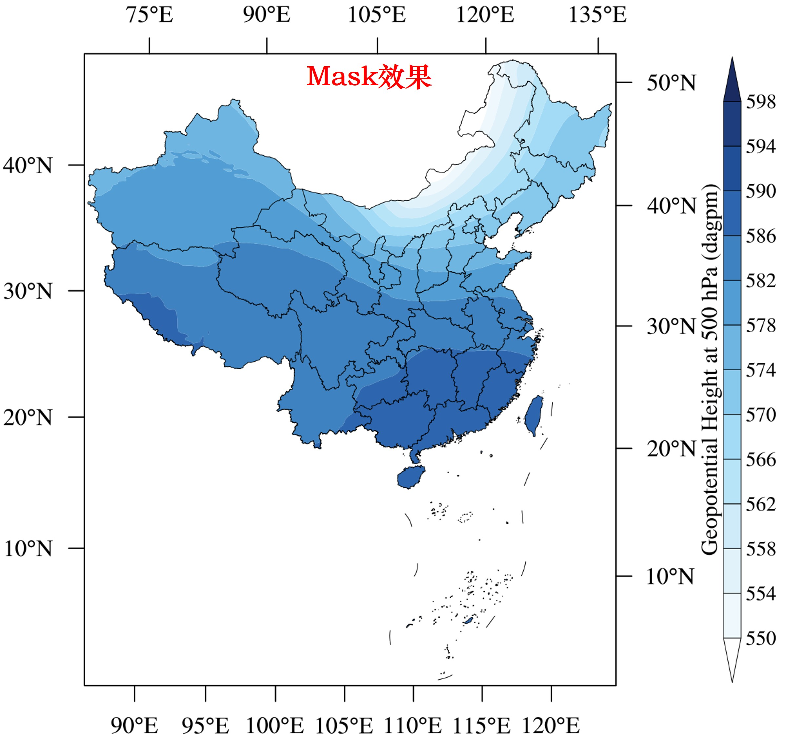

# NCL-BetterChinaMapdata

**精确绘制中国地图 | 国界/省界修正 | 高效MASK**


本项目旨在完善NCL（NCAR Command Language）的二进制地图文件，提供符合中国官方标准的精确地图数据。

## 🌟 核心特性
- ​**精准地图边界数据**：参考 http://www.webmap.cn/commres.do?method=result100W 和 https://github.com/ZhaJiMan/frykit 的地图数据, 对NCL原生地图的中国国界、省界、南海诸岛等进行了修正。

- ​**归属与命名修正**：参考 https://github.com/huangynj/NCL-Chinamap ，对台湾省归属、钩鱼岛命名等内容进行修正。







## 🚀 使用方法

### 全局替换
下载database目录中的Earth..4.lines和Earth..4.names放到$NCARG_ROOT/lib/ncarg/database目录中，覆盖旧文件，这种方法全局生效。
```ncl
res@mpDataBaseVersion = "MediumRes" 
res@mpDataSetName     = "Earth..4"
```

### 显式指定
将下载Earth..4.lines和Earth..4.names放在同一个目录，然后在NCL脚本显式指定文件所在位置，这种方法适合在临时工作环境下使用。
```ncl
res@mpDataBaseVersion = "MediumRes" 
res@mpDataSetName     = "/path/to/your/Earth..4" ;注意，不带后缀
```
